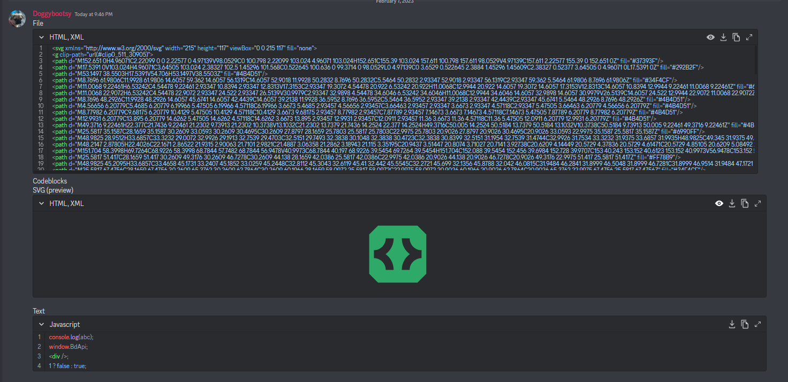

# Enhance CodeBlocks
A BetterDiscord plugin that aims to make Discords codeblocks better.

## Features
* SVG Preview
* Line Numbers
* Download
* Copy
* Collapsability
* Change File type

## Codeblocks

(File attachment and codeblocks)
## Modal

(SVG preview within the modal)
## Change Language

(Showing how the tsx alias will show typescript)

Allows searching using language name and language aliases