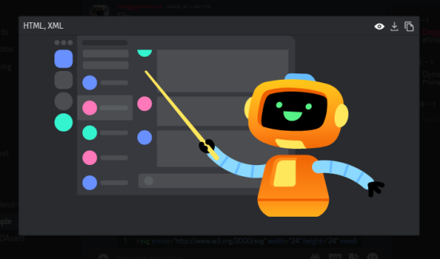

# Enhance CodeBlocks
A BetterDiscord plugin that aims to make Discords codeblocks & text file attachments better.

## Features
* SVG Preview
* Line Numbers
* Download
* Copy
* Collapsability
* Change File type

## Codeblocks


(File attachment and codeblocks)
## Modal


(SVG preview within the modal)
## Change Language


(Showing how the tsx alias will show typescript)

Allows searching using language name and language aliases

## Building

First clone the repo

```bat
git clone https://github.com/doggybootsy/enhancecodeblocks.git
```

then install the deps

```bat
npm i @react-spring/web@^9.6.1
npm i @types/react@^18.0.27
npm i esbuild@^0.17.6
npm install @types/betterdiscord@github:zerthox/betterdiscord-types
```

Finally to build run 

```bat
npm run build
```